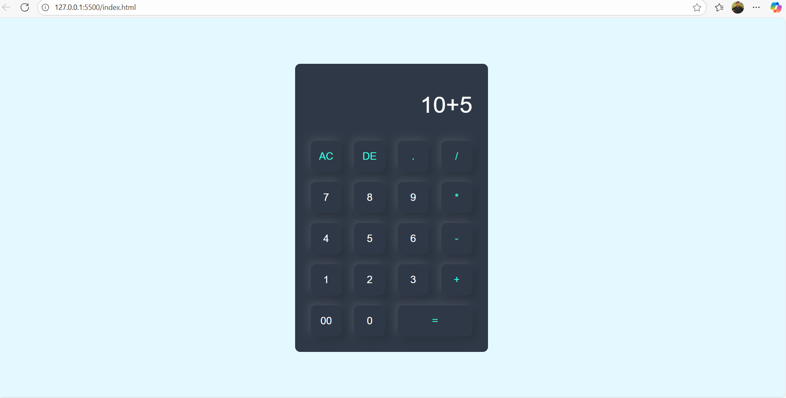

# 🧮 Simple Calculator App

A basic calculator built using HTML, CSS, and JavaScript.  
It can perform **addition, subtraction, multiplication, and division**.

## 🚀 Features
- User-friendly interface
- Supports basic arithmetic operations
- Instant result display

## 📸 Screenshot

## 📂 How to Use
1. Clone the repository  
git clone https://github.com/Shravan-kumar-gupta/calculator-app.git

markdown
Copy
Edit
2. Open `index.html` in your browser

## 📌 Technologies Used
- HTML
- CSS
- JavaScript

## 🙌 Contribute
Feel free to fork the repo and submit a pull request.
